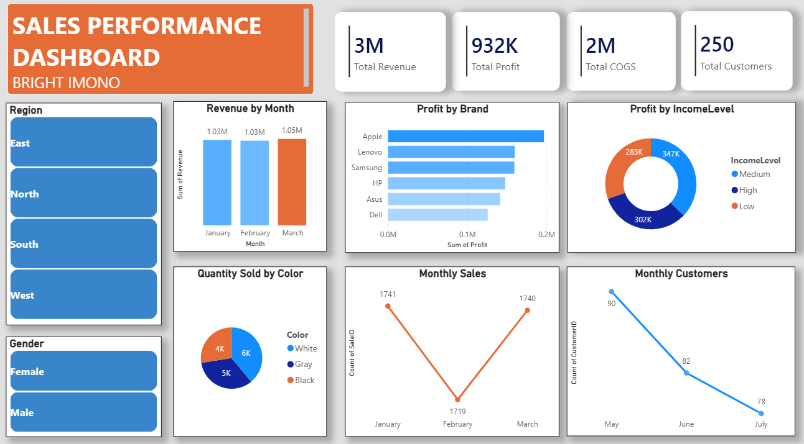

# Sales Performance Dashboard – Power BI

## Project Overview

This project presents an interactive Sales Performance Dashboard developed using Microsoft Power BI.

The dashboard provides insights into sales performance, revenue, profit, cost of goods sold, customers, product/brand performance, customer demographics, regional performance, and monthly sales trends.

## Dashboard Preview

## Key Performance Indicators

- Total Revenue: 3M
- Total Profit: 932K
- Total COGS: 2M
- Total Customers: 250

## Key Analysis Areas

The dashboard analyzes:

- Revenue by Month
- Profit by Brand
- Profit by Income Level
- Quantity Sold by Color
- Monthly Sales
- Monthly Customers
- Regional Performance
- Gender Distribution

## Tools & Technologies

- Microsoft Power BI
- Power Query
- DAX
- Microsoft Excel
- Data Cleaning
- Data Transformation
- Data Visualization
- Business Intelligence

## Business Questions

This dashboard was designed to help answer questions such as:

1. How is revenue changing over time?
2. Which brands generate the highest profit?
3. Which customer income groups contribute most to profit?
4. Which product colors have the highest sales volume?
5. How does customer activity change over time?
6. Which regions contribute to overall performance?

## Key Insights

- Total revenue reached approximately 3M.
- Total profit was approximately 932K.
- Apple recorded the highest profit among the displayed brands.
- Medium-income customers represented the largest displayed income segment.
- Sales volume remained relatively stable across the three displayed months.

## My Role

I was responsible for data preparation, analysis, visualization, KPI development, and dashboard design.

## Skills Demonstrated

- Data Analysis
- Data Cleaning
- Data Visualization
- Dashboard Development
- KPI Analysis
- Business Intelligence
- Power BI
- Excel
- DAX

## Project Outcome

The dashboard transforms raw sales information into an interactive business intelligence report that allows users to identify trends, compare performance, and support data-driven decision-making.
